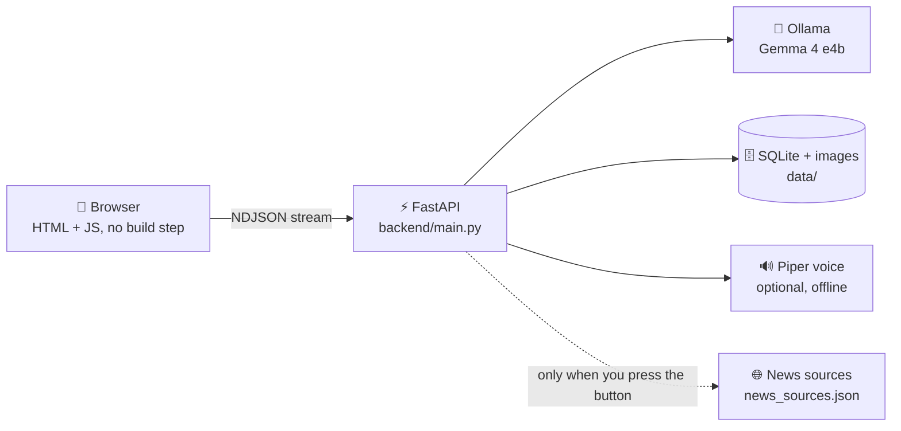

<div align="center">

# 🌾 AgriLens
### कृषि लेन्स — an offline, Nepali-first farming assistant

**Snap a photo. Read the label. Ask in Nepali. Listen to the answer.**
All on your own laptop or phone, with no cloud AI and no subscription.


[Features](#-features) · [Quick start](#-quick-start) · [How it works](#-how-it-works) · [Configuration](#-configuration) · [Troubleshooting](#-troubleshooting) · [Safety](#%EF%B8%8F-agricultural-safety-disclaimer)

</div>

---

## 📖 What is AgriLens?

AgriLens is a simple web page that runs on a farmer's own computer. It uses **Gemma 4 through Ollama** to look at photos, read text and answer questions, and everything stays on the device. It was designed for farmers in Nepal, so the interface and the answers default to **simple Nepali (देवनागरी)**, with English available at one tap.

It is built around one rule: **a printed product label is the source of truth.** The assistant never invents doses, mixing ratios, waiting periods or safety gear. If something can't be read, it says so.

---

## ✨ Features

| Tab | What it does |
|---|---|
| 🌿 **Plant (बाली)** | Take a close-up of a sick leaf, fruit or stem. AI describes what is visible, lists *possible* causes (never a definite diagnosis) and suggests safe next steps. |
| 🧪 **Label (लेबल)** | Photograph the front and back of a pesticide or fertilizer pack. AI reads what is printed and shows it in a short card. It then adds general knowledge on what the product is used for and how it is generally applied. |
| 📄 **Docs (कागजात)** | Upload a PDF, photo or text file, get a summary and ask questions. Answers cite page numbers. Handles scanned PDFs and old-font Nepali PDFs through photo-reading (OCR). |
| 📰 **News (समाचार)** | Fetch farm news from sources you choose, summarize them in Nepali and read them offline later. |
| 💬 **Chat (च्याट)** | Free chat, with optional photos. Type, speak or do both in the same message. You can also jump into a chat about any earlier plant or label result. |

### Highlights

- 🇳🇵 **Nepali-first:** UI, prompts and spoken answers; switch to English any time.
- 🔊 **Listen to every answer:** offline neural voice (Piper), or the browser's Nepali voice, or a Hindi fallback with a notice.
- 🎤 **Type and speak together:** voice is added after what you typed. You can keep typing while the mic is on.
- 🏷️ **Evidence badges:** every plant finding is marked `OBSERVED`, `EXTRACTED`, `INFERRED` or `UNKNOWN`, so farmers can see how sure the AI is.
- 📸 **Photo quality check:** too dark, blurry or small? The app asks for a better photo instead of guessing.
- 🔎 **Label "learn more":** after a scan, a separate section explains what the product is for and how it is generally applied. It is clearly marked as general knowledge, not label text, and never contains doses.
- 🧠 **Remembers everything locally:** chats, scans, documents and news are saved on the device and survive restarts.
- 📱 **Phone friendly:** open it from a phone on the same Wi-Fi; photos are shrunk on the phone before upload; large text and dark mode buttons are built in.
- 🔒 **Private by design:** nothing leaves the device, except news fetching (only when you press the button) and the browser's speech-to-text.

---

## 🚀 Quick start

### Requirements

- **Python 3.10+**
- **[Ollama](https://ollama.com) 0.20 or newer**
- A laptop that can run the model (the `gemma4:e4b` model is the default)

### Install and run

```bash
# 1. Get the model (once)
ollama pull gemma4:e4b

# 2. Create a virtual environment and install
python -m venv .venv
source .venv/bin/activate          # Windows: .venv\Scripts\activate
pip install -r requirements.txt

# 3. Start the server
uvicorn backend.main:app --host 0.0.0.0 --port 8000
```

Open **http://localhost:8000**.
On a phone on the same Wi-Fi, open `http://<laptop-ip>:8000`.

Check that the model is ready:

```bash
curl localhost:8000/api/health
```

The page also shows a yellow banner at the top if Ollama isn't running, the model is missing or it is still warming up.

### Speed tips (set before running `ollama serve`)

```bash
OLLAMA_FLASH_ATTENTION=1
OLLAMA_KV_CACHE_TYPE=q8_0
OLLAMA_NUM_PARALLEL=1
```

---

## 🧭 How it works



- **Streaming:** answers arrive token by token, with a live timer and a **Stop** button.
- **One job at a time:** a laptop runs one generation at a time, so extra requests wait in line (the UI says so).
- **Structured output:** plant, label, match, news and "learn more" answers use JSON schemas, so the model must return valid, predictable fields.
- **Document search:** documents are split into chunks and searched with BM25 over **3-character grams**, which keeps Nepali word endings (धानको / धानमा) matching.
- **Smart image prep:** photos are rotated by EXIF data, resized, optionally contrast-boosted, and checked for darkness and blur before the model sees them.

### Reading a label (the flow)

1. Choose **Pesticide / Fungicide** or **Fertilizer (NPK)**.
2. Add the front photo, and ideally the back photo too.
3. Tap **Read label**. The result card is grouped into **What is it**, **How to use (as printed)** and **Safety**. Anything not printed is collapsed into a single *"Not found on label"* line.
4. A **More info** section is added automatically, explaining what the product is used for, how it works, how it is generally applied and basic precautions. This comes from the model's general knowledge of the active ingredient and is cached with the scan.
5. Optional: **Does this product suit my plant problem?** compares your last plant photo with the label's printed targets.

> The "learn more" section is generated offline from the model's own knowledge, so it can be wrong. It never gives doses, and it always tells the farmer to follow the label. To show a button instead of running it automatically, set `AUTO_LEARN = false` at the top of `frontend/app.js`.

---

## 🔊 Nepali voice

1. **Works immediately:** the browser voice. It needs a Nepali voice in the device's text-to-speech settings, and falls back to a Hindi voice with a notice.
2. **Offline neural voice (recommended for farmers' laptops):**
   ```bash
   pip install piper-tts
   python scripts/get_voice.py     # downloads the Nepali voice, about 60 MB, once
   ```
   Restart the server. Test it:
   ```bash
   echo "नमस्कार किसान दाइ" | python -m piper -m data/voices/ne_NP-google-medium.onnx -f /tmp/t.wav
   ```
   If your Piper version uses different flags, set `AGRILENS_TTS_CMD` (see `backend/tts.py`).
3. **Microphone (voice input):** uses the browser's speech recognition. It works in **Chrome only**, needs **internet**, and needs **https or localhost**. The 🎤 button is hidden on plain `http://<ip>`.

---

## 📰 News

1. Open `news_sources.json`.
2. Set `"enabled": true` and a real `url` for each source you want (RSS/Atom feeds, or plain HTML pages using `link_contains`).
3. Check a source before adding it:
   ```bash
   python -m backend.news https://example.com/feed
   ```
4. In the app, press **Fetch new articles**. Press **Summarize** on one article or **Summarize all**.

News is contacted **only when you press the button**, and only for the sources you listed. Links must stay on the same site as the source. Summaries are cached, so they can be read and listened to offline.

---

## ⚙️ Configuration

All settings live in `backend/config.py` and can be overridden with environment variables.

| Variable | Default | Meaning |
|---|---|---|
| `OLLAMA_URL` | `http://localhost:11434` | Where Ollama runs |
| `AGRILENS_MODEL` | `gemma4:e4b` | Model name |
| `AGRILENS_NUM_CTX` | `8192` | Context size. **Keep it constant**, because Ollama reloads the model if it changes |
| `AGRILENS_KEEP_ALIVE` | `30m` | How long the model stays in RAM |
| `AGRILENS_THINK` | `0` | `1` enables thinking mode (slower) |
| `AGRILENS_IMG_MAX` | `1280` | Longest image side sent to the model (plants, chat) |
| `AGRILENS_LABEL_IMG_MAX` | `1600` | Same for labels, which need more pixels for small print |
| `AGRILENS_MAX_UPLOAD_MB` | `25` | Maximum upload size |
| `AGRILENS_OCR_MAX_PAGES` | `8` | Maximum pages read by photo-reading |
| `AGRILENS_DATA` | `./data` | Where the database, images and voices are stored |
| `AGRILENS_TTS_MODEL` | `data/voices/ne_NP-google-medium.onnx` | Piper voice file |
| `AGRILENS_TTS_CMD` | `python -m piper ...` | Custom Piper command |
| `AGRILENS_NEWS_SOURCES` | `./news_sources.json` | News source list |

Example (Linux/macOS):

```bash
AGRILENS_KEEP_ALIVE=2h AGRILENS_LABEL_IMG_MAX=1800 uvicorn backend.main:app --host 0.0.0.0 --port 8000
```

---

## 🗂️ Project structure

```
AgriLens/
├── backend/
│   ├── main.py        # FastAPI routes + NDJSON streaming
│   ├── services.py    # Use-cases: plant, label, label_learn, match, chat, docs
│   ├── llm.py         # Async Ollama client, queue, keep-alive, warm-up
│   ├── prompts.py     # System prompt, task prompts, JSON schemas, messages
│   ├── images.py      # EXIF rotate, resize, contrast, quality checks
│   ├── rag.py         # PDF/photo/text -> chunks -> BM25 (Devanagari-aware)
│   ├── news.py        # RSS/Atom/HTML fetch -> SQLite -> Nepali summary
│   ├── tts.py         # Optional offline Nepali voice (Piper)
│   ├── db.py          # SQLite persistence
│   └── config.py      # All tunables
├── frontend/
│   ├── index.html
│   ├── app.js         # No build step
│   ├── i18n.js        # Nepali + English strings
│   └── styles.css
├── scripts/get_voice.py
├── news_sources.json
├── requirements.txt
└── data/              # created at runtime (git-ignored)
```

---

## 🔌 API at a glance

| Method | Endpoint | Purpose |
|---|---|---|
| GET | `/api/health` | Ollama, model and voice status |
| POST | `/api/plant` | Analyze a plant photo |
| POST | `/api/label` | Read a label (front + optional back) |
| POST | `/api/records/{id}/learn` | General "what is it used for / how" info for a scanned label |
| POST | `/api/match` | Compare a plant problem with a label |
| GET / DELETE | `/api/records`, `/api/records/{id}` | Scan history |
| POST / GET / DELETE | `/api/docs`, `/api/docs/{id}/...` | Upload, summarize, ask, delete documents |
| POST / GET / DELETE | `/api/chat`, `/api/chats...` | Chat and chat history |
| GET / POST | `/api/news`, `/api/news/refresh`, `/api/news/{id}/summary` | News |
| POST | `/api/tts` | Offline voice (when Piper is installed) |

Long-running endpoints stream **NDJSON** events: `queued`, `progress`, `delta`, `result`, `warn`, `error`, `done`.

---

## 💾 Your data

Everything (chats, scans, documents, news) lives in `data/agrilens.db` and `data/img/`.
**Back it up** by copying the `data/` folder. **Reset** by deleting it.

---

## 🛠️ Troubleshooting

| Problem | Fix |
|---|---|
| Yellow banner: *AI (Ollama) is not running* | Run `ollama serve` in a terminal |
| Banner: *Model not found* | Run `ollama pull gemma4:e4b` |
| First answer is very slow | The model is loading. Wait for the banner to disappear, or raise `AGRILENS_KEEP_ALIVE` |
| Answers get slower after changing settings | Keep `AGRILENS_NUM_CTX` constant; changing it reloads the model |
| No 🎤 button | You need Chrome, internet, and https or localhost (not plain `http://<ip>`) |
| No Nepali voice | Add one in the device's text-to-speech settings, or install Piper (see above) |
| Piper test fails | Set `AGRILENS_TTS_CMD` for your Piper version |
| Scanned PDF is rejected | `pip install pypdfium2` (already in `requirements.txt`) |
| Nepali PDF text looks broken | Tick *"Nepali text looks broken"* when uploading to read it from images |
| Photo is rejected as blurry/dark | Retake in daylight, hold steady, or press *Analyze anyway* |
| Old UI after an update | Hard-refresh with Ctrl+Shift+R |
| Phone can't open the page | Same Wi-Fi? Server started with `--host 0.0.0.0`? Firewall allows port 8000? |

---

## 🤝 Contributing

Issues and pull requests are welcome. Please keep these project rules in any change:

1. **Never** let the AI invent doses, concentrations, mixing ratios, intervals, PPE, target crops or pests.
2. Treat the printed label as the source of truth; say so when something is unreadable.
3. Keep answers short and simple, because they are read on a phone or listened to.
4. Add new text to **both** Nepali and English in `frontend/i18n.js`.

---

## ⚠️ Agricultural Safety Disclaimer

AgriLens provides AI-generated agricultural information for informational purposes only. Its responses may be inaccurate, incomplete, or outdated and should not be treated as a substitute for qualified agricultural advice. Always verify pesticide and fertilizer labels and follow the manufacturer's instructions and applicable local regulations before use.

---

## 📜 Third-Party Licenses

AgriLens is licensed under the MIT License. This license applies to the AgriLens project code owned by The 127.

Third-party software, libraries, AI models, datasets, and external resources used by AgriLens are subject to their respective licenses and terms of use. In particular, the Gemma model and Ollama are governed by their applicable terms. The AgriLens MIT License does not replace or override those terms.

Users and contributors should review and comply with the applicable terms for third-party components.

---

<div align="center">

**Made with 🌱 for Nepali farmers by The 127**
MIT License · © 2026 The 127

</div>
